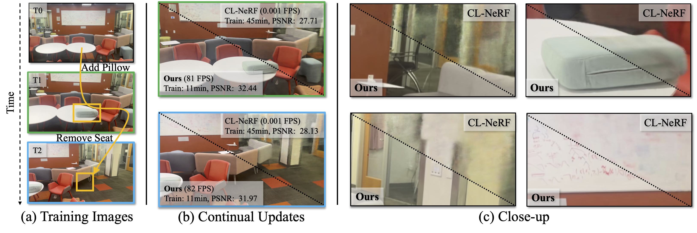

# CL-Splats: Continual Learning of Gaussian Splatting with Local Optimization

###  ICCV 2025
[](https://cl-splats.github.io/) [](https://arxiv.org/abs/2506.21117)


[Jan Ackermann](https://janackermann.info)
[Jonas Kulhanek](https://jkulhanek.com)
[Shengqu Cai](https://primecai.github.io)
[Haofei Xu](https://haofeixu.github.io)
[Marc Pollefeys](https://people.inf.ethz.ch/marc.pollefeys/)
[Gordon Wetzstein](https://stanford.edu/~gordonwz/)
[Leonidas Guibas](https://geometry.stanford.edu/?member=guibas)
[Songyou Peng](https://pengsongyou.github.io)



*TL;DR*: CL-Splats optimizes existing 3DGS scene representations with a small set of images showing the changed region.

## Contents
<!--ts-->
   * [Install](#install)
   * [Usage](#usage)
   * [Todos](#todos)
   * [Citation](#citation)
<!--te-->

## Install

### Pre-requisites
While not strictly necessary for using our method, COLMAP is necessary to obtain camera poses for the initial reconstruction as well as to add new observations to existing models.
Please follow the instructions on the COLMAP website to install COLMAP. If possible install it with CUDA support.
 
### Environment
We tested our code on Ubuntu 24.04 with CUDA 12.8. It is easiest to install the environment using conda/mamba from the environment file `environment.yaml`.

> **Note:**  
> Make sure that your installed PyTorch (`torch`) version is compiled with the **same CUDA version** as the one you use to compile the custom CUDA kernels in this project.  
> Additionally, you must have the **CUDA Development Kit** installed on your system to provide access to required CUDA libraries for compilation and runtime.


## Usage

### Computing Poses
In our work, we describe two different ways to obtain poses, which both use COLMAP. In this repository we will focus on the second incremental way. While it may lead to slightly worse reconstruction performance, it scales better with more timesteps and it is possible to build it incrementally. We also see it as a chance to promote further research improving issues with existing pose-estimation methods for incremental updates under changes.

For your convenience, we provide a python script `clsplats/utils/preprocessing.py` that given data automatically obtains the poses. The functionality of this script is explained in the supplementary material of our paper.
To run the preprocessing script and compute poses, use:
```bash
python3 clsplats/utils/preprocessing.py --input_dir <path/to/your/input>
```

The script assumes the following directory structure:
```text
path/to/your/input/
├── t0/
│   ├── *.{png,jpeg,jpg}
│   ├── *.{png,jpeg,jpg}
│   └── ...
├── t1/
│   ├── *.{png,jpeg,jpg}
│   ├── *.{png,jpeg,jpg}
│   └── ...
├── t2/
│   ├── *.{png,jpeg,jpg}
│   ├── *.{png,jpeg,jpg}
│   └── ...
└── ...
```


> **Note:**  
> While you can obtain the poses yourself, our codebase currently only supports NeRF-Synthetic and COLMAP poses. Additionally, their naming scheme must be consistent with the one produced by our script! 


### Running CL-Splats
First, make sure to override the paths to the data in the config files. Values that must be overriden are marked by <>.

Then you can run the model by invoking a script under scripts.
> **Note:**  
> Note that as of now, not the complete pipeline is released. Please refer to [Todos](#todos) to see the progress of releases.


## Todos
My goal is to release the code in a shape that is a) easy to use and extend, b) easy to understand, and c) useful.
Until ICCV, I will release the missing modules to replicate our method. I plan to slightly upgrade these modules following improvements to e.g. 3DGS done in the meantime.

- [x] Release initial codebase with framework skeleton.
- [x] Release fast change detection module.
- [] Release sampling module.
- [] Release pruning module.
- [] Release local-optimization CUDA kernels.
- [] Release data.
- [] Release history recovery.

## Citation
```
@inproceedings{ackermann2025clsplats,
    author={Ackermann, Jan and Kulhanek, Jonas and Cai, Shengqu and Haofei, Xu and Pollefeys, Marc and Wetzstein, Gordon and Guibas, Leonidas and Peng, Songyou},
    title={CL-Splats: Continual Learning of Gaussian Splatting with Local Optimization},
    booktitle={Proceedings of the IEEE/CVF International Conference on Computer Vision (ICCV)},
    year={2025}
}
```